# 🏥 Sistema de Fila Hospitalar em Tempo Real

## 📌 Visão Geral

Este projeto consiste em um **Sistema de Fila de Espera para Hospitais e Clínicas**, desenvolvido em **Python com Flask**, cujo principal diferencial é permitir que o **paciente acompanhe sua posição na fila em tempo real diretamente pelo celular ou navegador**.

O sistema foi pensado para melhorar a experiência do paciente e otimizar a gestão do estabelecimento de saúde, trazendo **transparência**, **previsibilidade** e **organização** ao processo de atendimento.

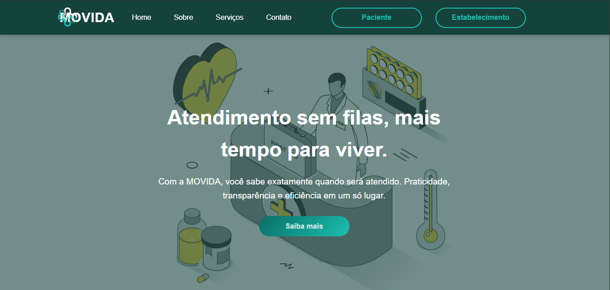

---

## 🚀 Diferencial do Projeto

O grande diferencial do sistema é o **acompanhamento online da fila em tempo real**, permitindo que o paciente:

* Saiba exatamente **qual é sua posição na fila**;
* Veja o **tempo estimado de espera**;
* Consulte sua **classificação de risco**;
* Acompanhe os **últimos pacientes chamados** e os **próximos da fila**.

Isso possibilita que o paciente possa, por exemplo:

* Ir comprar algo;
* Buscar um filho na escola;
* Se deslocar com mais tranquilidade;

Tudo isso sem o medo de perder sua vez, pois ele tem **previsibilidade do atendimento**.

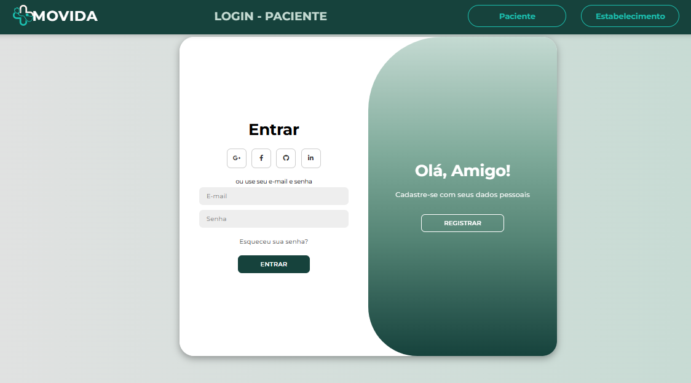
---

## 👤 Funcionalidades do Paciente

Cada paciente possui um **ambiente próprio**, acessado por login.

No painel do paciente, é possível visualizar:

* 📍 **Posição atual na fila** (em tempo real);
* ⏱️ **Tempo estimado de espera**;
* 🚦 **Classificação de risco**:

  * Verde
  * Amarelo
  * Laranja
  * Vermelho
* 👨‍⚕️ **Os 5 últimos pacientes chamados (em atendimento)**;
* 👥 **Os 5 primeiros pacientes ainda aguardando na fila**.

Essas informações são atualizadas dinamicamente, garantindo **transparência e confiança**.

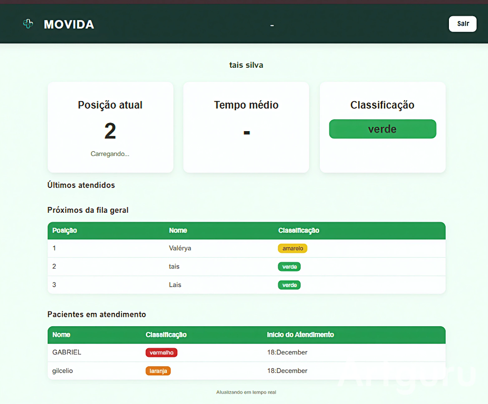

---

## 🏥 Funcionalidades do Estabelecimento (Hospital / Clínica)

O estabelecimento possui um **ambiente administrativo exclusivo**, acessado por login próprio.

### 📋 Gerenciamento da Fila

O estabelecimento pode:

* Adicionar pacientes à fila;
* Visualizar a fila **em tempo real**;
* Ver quais pacientes estão **aguardando** e quais estão **em atendimento**;
* Iniciar atendimento de um paciente;
* Finalizar atendimento;
* Remover pacientes da fila ao encerrar o atendimento.

Página de cadastro dos pacientes na fila
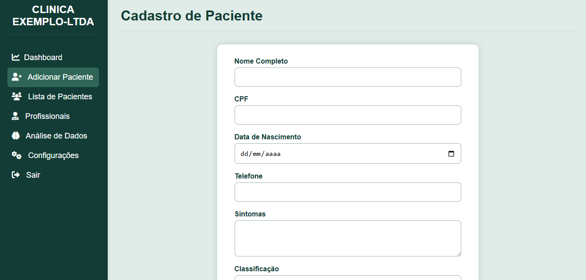

Fila de espera

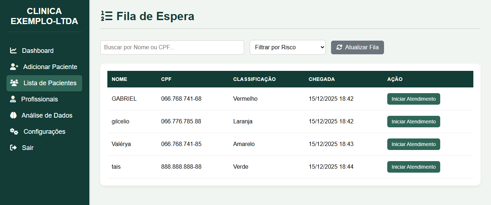

### 📊 Indicadores em Tempo Real

O sistema exibe automaticamente:

* Quantidade de pacientes:

  * 🧍 Na fila de espera;
  * 🩺 Em atendimento;
  * ✅ Atendimentos encerrados no dia.

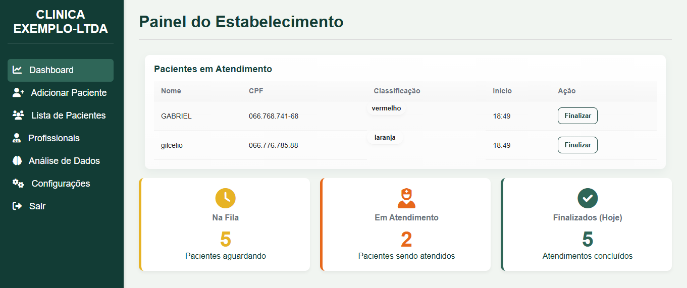
---

## 👨‍⚕️ Cadastro de Profissionais de Saúde

A clínica pode:

* Cadastrar médicos e profissionais no sistema;
* Selecionar o profissional responsável **no momento de iniciar um atendimento**;

Isso garante melhor organização e rastreabilidade dos atendimentos realizados.

Gerenciamento de Profissionais
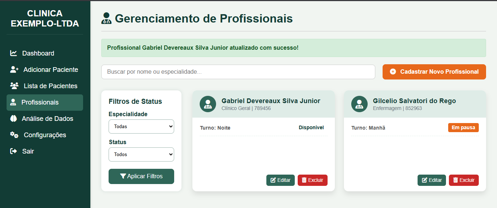

Cdastro de Profissionais
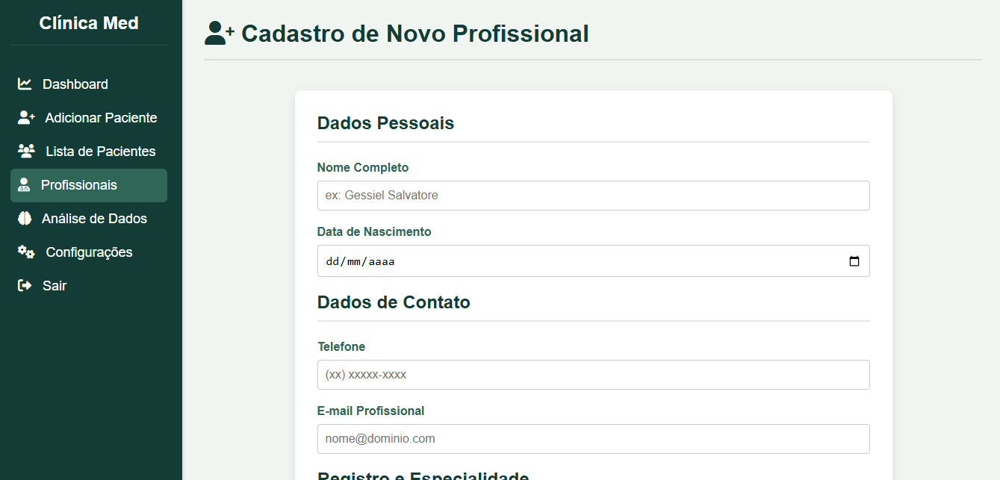

---

## 📈 Análise de Dados (Business Intelligence)

O sistema conta com uma **área de análise de dados**, onde o estabelecimento pode:

* Fazer perguntas sobre os dados do próprio estabelecimento;
* Receber como resposta:

  * 📊 **Gráficos gerados com Matplotlib**; 
  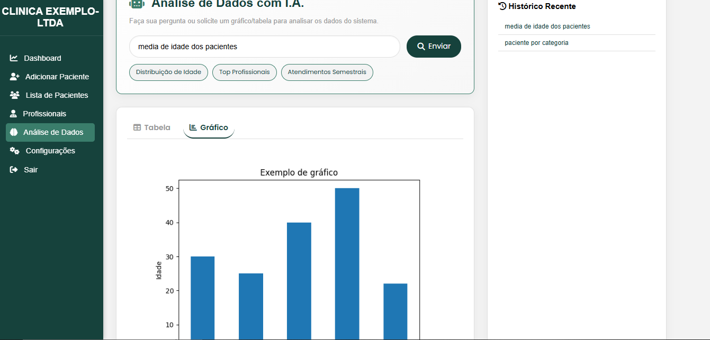
  * 📋 **Tabelas geradas com Pandas**; 
  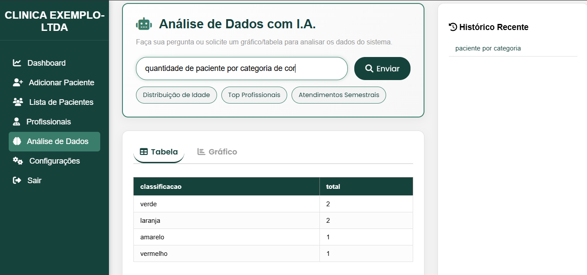

Esses recursos auxiliam na tomada de decisão, análise de fluxo de pacientes e desempenho diário.

---

## ⚙️ Configurações do Estabelecimento

Na área de configurações, o estabelecimento pode:

* Alterar o nome da empresa;
* Atualizar o e-mail de acesso;
* Ativar ou desativar notificações;
* Excluir a conta do sistema. 
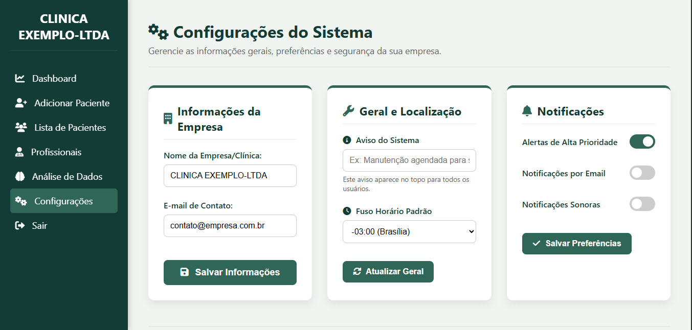

---

## 🛠️ Tecnologias Utilizadas

O projeto foi desenvolvido em **Python**, utilizando as seguintes tecnologias e bibliotecas:

### Backend

* **Flask** (framework web)
* **Werkzeug** (segurança de senhas)
* **MySQL Connector** (conexão com banco de dados MySQL)
* **dotenv** (variáveis de ambiente)

### Manipulação de Dados e Gráficos

* **Pandas** (análise e manipulação de dados)
* **Matplotlib** (geração de gráficos)

## 🛠️ Tecnologias, Bibliotecas e Dependências
#### 🌐 Framework Web

* Flask

* render_template

* request

* redirect

* url_for

* session

* flash

* jsonify

* Response

#### 🔐 Segurança e Autenticação

* Werkzeug Security

* generate_password_hash

* check_password_hash

#### 🕒 Manipulação de Datas e Horários

* Datetime

* datetime

#### 🗄️ Banco de Dados

* MySQL Connector

* mysql.connector.Error

* Camada de acesso ao banco

* get_db

* Models da aplicação

* app.models

#### 📊 Análise de Dados e Visualização

* Pandas

* Matplotlib

#### 🤖 Inteligência Artificial e Processamento de Dados

* Gemini AI

* gemini_instrucao_segura

* Operações com Pandas

* executar_operacao

#### ⚙️ Utilitários e Configurações

* dotenv

* load_dotenv

* Funções utilitárias

* functools.wraps

* Manipulação de arquivos e sistema

* os

* io

* json

---

## 🗂️ Estrutura Geral do Sistema

* **Autenticação separada** para paciente e estabelecimento;
* **Sessões seguras** para controle de acesso;
* **Atualização em tempo real da fila**;
* **Integração entre dados operacionais e análise de dados**;
* **Arquitetura modular**, facilitando manutenção e evolução do projeto.

---

## 🎯 Objetivo do Projeto

O objetivo principal é:

* Melhorar a experiência do paciente;
* Reduzir filas físicas e aglomerações;
* Oferecer dados estratégicos para o estabelecimento;
* Tornar o atendimento mais humano, previsível e eficiente.

---

📄 **Projeto desenvolvido com foco em usabilidade, organização e análise de dados.**
---
## 📌 Documentação das Rotas

---

## 🌐 Rotas Públicas

### `/`
- **Método:** `GET`
- **Descrição:**  
  Página inicial do sistema (landing page), acessível tanto para **pacientes** quanto para **estabelecimentos**.

---

## 🏥 Rotas do Estabelecimento (Hospital / Clínica)

### `/registrar_empresa`
- **Métodos:** `GET`, `POST`
- **Descrição:**
  - **GET:** Exibe o formulário de cadastro do estabelecimento
  - **POST:** Registra uma nova empresa no sistema, com validação de senha e dados institucionais

---

### `/login_estabelecimento`
- **Método:** `GET`
- **Descrição:**  
  Exibe a página de login do estabelecimento.

---

### `/login_empresa`
- **Método:** `POST`
- **Descrição:**  
  Processa o login do estabelecimento, valida credenciais e cria uma sessão segura.

---

### `/logout` | `/logout_estabelecimento`
- **Método:** `GET`
- **Descrição:**  
  Realiza o logout do estabelecimento, limpa a sessão e atualiza a fila em tempo real via **Socket.IO**.

---

### `/tela-principal-estabelecimento`
- **Método:** `GET`
- **Descrição:**  
  Painel principal do estabelecimento, exibindo os **pacientes atualmente em atendimento**.

---

## 👤 Rotas do Paciente (Cliente)

### `/login_cadastro_paciente`
- **Método:** `GET`
- **Descrição:**  
  Exibe a tela unificada de **login e cadastro** do paciente.

---

### `/registrar_cliente`
- **Método:** `POST`
- **Descrição:**  
  Cria uma nova conta de paciente com validações de segurança:
  - Senha mínima
  - Confirmação de senha

---

### `/login_cliente`
- **Método:** `POST`
- **Descrição:**  
  Autentica o paciente e inicia sua sessão no sistema.

---

### `/logout_cliente`
- **Método:** `GET`
- **Descrição:**  
  Encerra a sessão do paciente, mantendo intacta a sessão do estabelecimento.

---

### `/fila`
- **Método:** `GET`
- **Descrição:**  
  Painel do paciente para acompanhamento da fila em tempo real, exibindo:
  - 🔢 Posição atual na fila
  - ⏳ Tempo médio estimado de espera
  - 🚦 Classificação de risco
  - 👥 Últimos pacientes atendidos

---

## 📡 APIs (Dados em Tempo Real)

### `/api/primeiros_fila`
- **Método:** `GET`
- **Descrição:**  
  Retorna os **4 primeiros pacientes na fila de espera**, incluindo:
  - Nome
  - Classificação
  - Posição

---

### `/api/em_atendimento`
- **Método:** `GET`
- **Descrição:**  
  Retorna os **4 pacientes atualmente em atendimento**, com horário de início.

---

## 🔄 WebSocket — Atualização em Tempo Real

### Namespace: `/fila`

#### Evento: `connect`
- **Descrição:**  
  Disparado quando um paciente se conecta ao sistema de fila.

---

#### Evento: `join_fila`
- **Descrição:**  
  O paciente entra na fila e inicia uma **thread dedicada**, que atualiza sua posição a cada **3 segundos**.

---

#### Evento emitido: `fila_update`
- **Descrição:**  
  Envia automaticamente ao paciente:
  - Posição atual
  - Tempo médio estimado
  - Classificação de risco
  - Últimos atendimentos

---

## 🧍‍♂️ Gerenciamento de Pacientes (Estabelecimento)

### `/cadastrar-paciente`
- **Método:** `GET`
- **Descrição:**  
  Exibe o formulário para cadastro de pacientes na fila, incluindo seleção do **profissional responsável**.

---

### `/cadastro`
- **Método:** `POST`
- **Descrição:**  
  Insere o paciente na fila do estabelecimento e notifica todos os clientes conectados em tempo real.

---

### `/lista-pacientes`
- **Método:** `GET`
- **Descrição:**  
  Lista todos os pacientes aguardando atendimento na fila.

---

### `/iniciar_atendimento/<fila_id>`
- **Método:** `POST`
- **Descrição:**  
  Move o paciente da fila para o estado **em atendimento**, atualizando todos os painéis em tempo real.

---

### `/remover_em_atendimento/<em_id>`
- **Método:** `POST`
- **Descrição:**  
  Finaliza o atendimento do paciente e remove do estado ativo.

---

## ⚙️ Configurações do Estabelecimento

### `/configuracoes-estabelecimento` | `/config_empresa`
- **Métodos:** `GET`, `POST`
- **Descrição:**  
  Permite:
  - ✏️ Alterar nome da empresa
  - ⚙️ Gerenciar configurações gerais

---

### `/excluir_conta`
- **Método:** `POST`
- **Descrição:**  
  Exclui permanentemente a conta do estabelecimento e todos os dados relacionados.

---

## 🤖 Módulo de Análise de Dados (Gemini + Pandas)

### `/gemini`
- **Método:** `GET`
- **Descrição:**  
  Exibe a interface de **análise inteligente de dados** do estabelecimento.

---

### `/gemini/tabela`
- **Método:** `POST`
- **Descrição:**  
  Gera uma **tabela dinâmica com Pandas**, baseada em um prompt do usuário e dados reais do sistema.

---

### `/gemini/grafico`
- **Método:** `POST`
- **Descrição:**  
  Retorna um **gráfico gerado com Matplotlib**, conforme solicitação do usuário.

---

## 👨‍⚕️ Gestão de Profissionais de Saúde

### `/profissionais`
- **Métodos:** `GET`, `POST`
- **Descrição:**  
  Lista profissionais cadastrados, com filtros por:
  - Especialidade
  - Status

---

### `/cadastrar-profissional`
- **Métodos:** `GET`, `POST`
- **Descrição:**  
  Cadastra novos médicos ou profissionais de saúde no sistema.

---

### `/editar-profissional/<id>`
- **Métodos:** `GET`, `POST`
- **Descrição:**  
  Edita os dados de um profissional já cadastrado.

---

### `/excluir-profissional`
- **Método:** `POST`
- **Descrição:**  
  Remove um profissional do sistema.
---

## 🔄 Diagrama de Fluxo das Rotas do Sistema

### 👤 Diagrama — Fluxo do Paciente
flowchart TD
    A[👤 Paciente] --> B[/login_cadastro_paciente/]

    B -->|Cadastro| C[/registrar_cliente/]
    B -->|Login| D[/login_cliente/]

    D --> E[📊 Painel do Paciente]
    E --> F[/fila/]

    F -->|Conexão| WS[[🔄 WebSocket /fila]]
    WS -->|fila_update| F

    E --> G[/logout_cliente/]
🔎 O que este diagrama representa

* Autenticação do paciente

* Acesso ao painel de acompanhamento da fila

* Atualizações em tempo real

* Encerramento da sessão
---
### 🏥 Diagrama — Fluxo do Estabelecimento
flowchart TD
    A[🏥 Estabelecimento] --> B[/login_estabelecimento/]

    B -->|Cadastro| C[/registrar_empresa/]
    B -->|Login| D[/login_empresa/]

    D --> E[🏥 Painel do Estabelecimento]
    E --> F[/tela-principal-estabelecimento/]

    %% Gestão de Pacientes
    F --> G[/cadastrar-paciente/]
    G --> H[/cadastro/]
    F --> I[/lista-pacientes/]

    I -->|Iniciar Atendimento| J[/iniciar_atendimento/]
    F -->|Finalizar Atendimento| K[/remover_em_atendimento/]

    %% Profissionais
    F --> L[/profissionais/]
    L --> M[/cadastrar-profissional/]
    L --> N[/editar-profissional/]
    L --> O[/excluir-profissional/]

    %% Configurações
    F --> P[/config_empresa/]
    P --> Q[/excluir_conta/]

    %% Análise de Dados
    F --> R[/gemini/]
    R --> S[/gemini/tabela/]
    R --> T[/gemini/grafico/]

    %% Logout
    F --> U[/logout_estabelecimento/]
🔎 O que este diagrama representa

* Autenticação do estabelecimento

* Gestão completa da fila

* Profissionais de saúde

* Configurações da empresa

* Análise de dados com IA
---
### 📡 Diagrama — API & WebSocket (Tempo Real)
flowchart TD
    A[🖥️ Frontend] --> B[🌐 API Flask]

    %% APIs REST
    B --> C[/api/primeiros_fila/]
    B --> D[/api/em_atendimento/]

    %% WebSocket
    B --> WS[[🔄 WebSocket /fila]]

    WS -->|connect| E[👤 Paciente]
    WS -->|join_fila| F[📊 Monitoramento]

    F -->|fila_update (3s)| WS
    WS -->|Atualização| E

    %% Backend
    B --> DB[(🗄️ MySQL)]
🔎 O que este diagrama representa

* Comunicação REST para leitura de dados

* Comunicação WebSocket para tempo real

* Atualizações automáticas da fila

* Integração com banco de 
---
# 📊 Documentação do Banco de Dados – db_movida

Este documento descreve a estrutura do banco de dados **db_movida**, utilizado em um sistema de gerenciamento clínico com controle de empresas, pacientes, fila de atendimento, atendimentos em andamento e profissionais de saúde.

---

## 🗄️ Informações Gerais

- **Banco de Dados:** `db_movida`
- **SGBD:** MySQL / MariaDB
- **Charset:** `utf8mb4`
- **Collation:** `utf8mb4_general_ci`
- **Engine:** InnoDB

---

## 🧩 Estrutura das Tabelas

### 👤 tb_clientes
Armazena os dados de clientes do sistema.

| Campo        | Tipo            | Descrição |
|--------------|-----------------|-----------|
| id           | INT (PK)        | Identificador único |
| nome         | VARCHAR(100)    | Nome do cliente |
| email        | VARCHAR(100)    | Email único |
| nascimento   | VARCHAR(20)     | Data de nascimento |
| cpf          | VARCHAR(20)     | CPF único |
| rg           | VARCHAR(20)     | RG único |
| senha        | VARCHAR(255)    | Senha criptografada |
| criado_em    | TIMESTAMP       | Data de criação |

---

### 🏢 tb_empresa
Representa clínicas, hospitais ou empresas de saúde.

| Campo             | Tipo | Descrição |
|-------------------|------|-----------|
| id                | INT (PK) | Identificador da empresa |
| nome              | VARCHAR(150) | Nome da empresa |
| cnpj              | VARCHAR(18) | CNPJ único |
| segmento          | ENUM | Tipo de instituição |
| funcionarios      | INT | Quantidade de funcionários |
| site              | VARCHAR(255) | Site institucional |
| logo              | LONGBLOB | Logo da empresa |
| email             | VARCHAR(150) | Email |
| telefone          | VARCHAR(20) | Telefone |
| cep               | VARCHAR(9) | CEP |
| endereco          | VARCHAR(200) | Endereço |
| cidade            | VARCHAR(120) | Cidade |
| estado             | CHAR(2) | UF |
| senha             | VARCHAR(255) | Senha |
| confirmar_senha   | VARCHAR(255) | Confirmação da senha |
| descricao         | TEXT | Descrição |
| criado_em         | TIMESTAMP | Data de criação |

---

### 🧑‍⚕️ pacientes
Armazena pacientes vinculados a uma empresa.

| Campo | Tipo | Descrição |
|------|------|-----------|
| id | INT (PK) | Identificador do paciente |
| cpf | VARCHAR(20) | CPF |
| nome | VARCHAR(255) | Nome |
| nascimento | DATE | Data de nascimento |
| telefone | VARCHAR(20) | Telefone |
| sintomas | TEXT | Sintomas relatados |
| classificacao | ENUM | Nível de urgência |
| responsavel | VARCHAR(255) | Responsável |
| empresa_id | INT (FK) | Empresa vinculada |
| entrada_inicio | TIMESTAMP | Entrada do paciente |
| entrada_fim | TIMESTAMP | Saída |
| criado_em | TIMESTAMP | Registro |

🔗 **Relacionamento:**  
`pacientes.empresa_id → tb_empresa.id`

---

### ⏳ fila
Controla a fila de atendimento.

| Campo | Tipo | Descrição |
|------|------|-----------|
| id | INT (PK) | Identificador |
| paciente_id | INT (FK) | Paciente |
| empresa_id | INT (FK) | Empresa |
| chamado | BOOLEAN | Se foi chamado |
| chegada | TIMESTAMP | Horário de chegada |
| criado_em | TIMESTAMP | Registro |

🔗 **Relacionamentos:**  
- `paciente_id → pacientes.id`  
- `empresa_id → tb_empresa.id`

---

### 🩺 em_atendimento
Pacientes atualmente em atendimento.

| Campo | Tipo | Descrição |
|------|------|-----------|
| id | INT (PK) | Identificador |
| paciente_id | INT (FK) | Paciente |
| empresa_id | INT (FK) | Empresa |
| cpf | VARCHAR(20) | CPF |
| nome | VARCHAR(255) | Nome |
| nascimento | DATE | Nascimento |
| telefone | VARCHAR(20) | Telefone |
| sintomas | TEXT | Sintomas |
| classificacao | ENUM | Urgência |
| responsavel | VARCHAR(255) | Responsável |
| inicio_atendimento | TIMESTAMP | Início |
| fim_atendimento | TIMESTAMP | Fim |
| criado_em | TIMESTAMP | Registro |

---

### 👨‍⚕️ profissionais
Cadastro de profissionais da saúde.

| Campo | Tipo | Descrição |
|------|------|-----------|
| id | INT (PK) | Identificador |
| id_empresa | INT (FK) | Empresa |
| nome_completo | VARCHAR(150) | Nome |
| data_nascimento | DATE | Nascimento |
| telefone | VARCHAR(15) | Telefone |
| email_profissional | VARCHAR(100) | Email |
| especialidade | VARCHAR(50) | Especialidade |
| registro_crm_coren | VARCHAR(20) | Registro |
| estado_crm | CHAR(2) | UF |
| turno_atendimento | VARCHAR(10) | Turno |
| status_clinica | VARCHAR(15) | Status |
| informacoes_adicionais | TEXT | Observações |

---

## ⚡ Índices Criados

- `idx_pacientes_empresa_cpf` → otimiza buscas por empresa e CPF
- `idx_fila_empresa_chegada` → melhora ordenação da fila

---

## 🔗 Relacionamentos Principais

- Uma **empresa** pode ter vários **pacientes**
- Um **paciente** pode estar na **fila** ou em **atendimento**
- Uma **empresa** possui vários **profissionais**

---

## 📌 Observações Finais

Este banco foi projetado para:
- Suportar múltiplas empresas
- Controlar filas de atendimento
- Registrar atendimentos em tempo real
- Garantir integridade referencial com `FOREIGN KEYS`

---

📂 **Arquivo de inicialização:** `db_init.sql`

---

## 👾 Considerações Finais

Este projeto demonstra a aplicação prática de **desenvolvimento web com Python**, **gestão de filas em tempo real** e **análise de dados**, sendo ideal para:

* Hospitais;
* Clínicas;
* UPAs;
* Qualquer estabelecimento que trabalhe com filas de atendimento.

Ele pode ser facilmente expandido para incluir notificações por SMS, WhatsApp, integração com painéis físicos ou APIs externas.
---
## 📌 Encerramento

Este projeto foi desenvolvido como parte de um processo de aprendizado e prática em desenvolvimento web com **Python** e **Flask**, aplicando conceitos reais de **sistemas**, **filas de atendimento**, **atualização em tempo real** e **análise de dados**.

📂 **Repositório para clonagem:**  
👉 https://github.com/gabrielsilva798/Sistema-de-Fila-de-Atendimento-em-Flask---Projeto_SENAC.git

Agradeço ao **SENAC**, ao **Farol na Quebrada** e à **Serasa Experian** pela oportunidade, apoio e incentivo durante o desenvolvimento deste projeto, que foi fundamental para meu crescimento **técnico** e **profissional**.
